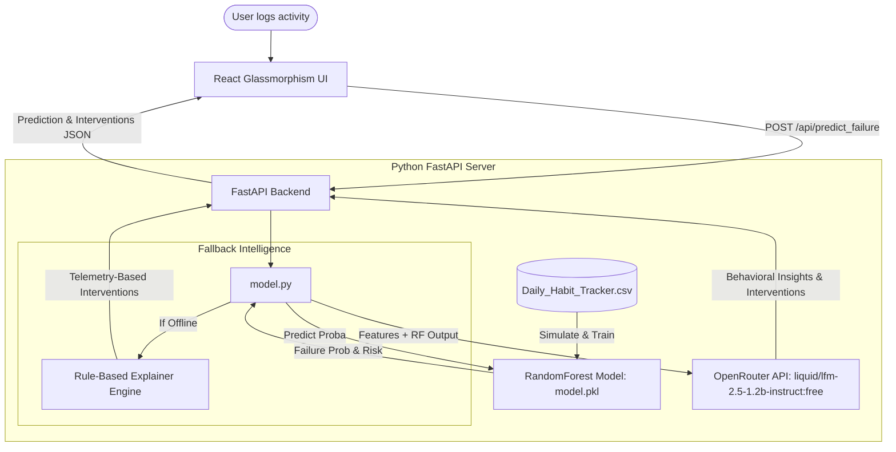

# HabitGuard AI – Micro-Habit Failure Predictor

HabitGuard AI is an intelligent, proactive habit-tracking platform that goes beyond simple streak logging. By utilizing a hybrid AI architecture—combining a local Random Forest Classifier trained on behavioral datasets with an explainable LLM layer via OpenRouter—it predicts habit abandonment *before* it happens and provides personalized, real-time interventions to keep users on track.

---

## 🚀 Vision & Problem Statement

### The Problem
Traditional habit trackers are **reactive**. They record when you succeed and inform you after you have already failed (broken your streak or abandoned the habit). By then, user motivation is depleted, leading to high abandonment rates.

### The Solution (HabitGuard AI)
HabitGuard AI introduces a **proactive** layer. It monitors user streaks, targets, and consistency to calculate a real-time **Failure Probability (0–100%)** and **Risk Level**. If risk levels rise, it triggers personalized, psychological interventions to help users adjust schedules or targets and maintain consistency.

---

## 🛠️ Hybrid AI Architecture



1. **Layer 1: Local Machine Learning (RandomForestClassifier)**
   - Computes statistical failure probability (0.0 to 1.0) and classifies risk (`Low`, `Medium`, `High`) based on telemetry: `target_days_per_week`, `current_streak`, `longest_streak`, and `completion_rate`.
   - Trained on historical user consistency trends derived from the [Daily_Habit_Tracker.csv](file:///c:/Users/lenovo/OneDrive/Desktop/AI%20Habit%20Predictor/dataset/Daily_Habit_Tracker.csv) dataset.
2. **Layer 2: Generative Explainable AI (OpenRouter LLM)**
   - Explains *why* the failure risk is high and translates statistics into empathetic, actionable insights and psychology-backed interventions.
   - Powered by the `liquid/lfm-2.5-1.2b-instruct:free` model for ultra-low latency (~1 second response time) and high uptime.
3. **Layer 3: Fallback Intelligence**
   - Automatically switches to a local Rule-Based Explainer Engine if the user is offline, OpenRouter is rate-limited, or API keys are not configured.

---

## 📋 Features & Status

| Feature | Description | Tech / File | Status |
| :--- | :--- | :--- | :---: |
| **Habit Tracking** | Custom habit creation, streak tracking, activity logging, and weekly frequency targets. | [Dashboard.jsx](file:///c:/Users/lenovo/OneDrive/Desktop/AI%20Habit%20Predictor/frontend/src/components/Dashboard.jsx) | **Completed** |
| **Persistent Storage** | Offline habit data persistence across browser refreshes. | `localStorage` integration | **Completed** |
| **Glassmorphism Modal** | Stunning blur-backdrop modal with animation scales and custom target slider. | [AddHabitModal.jsx](file:///c:/Users/lenovo/OneDrive/Desktop/AI%20Habit%20Predictor/frontend/src/components/AddHabitModal.jsx) | **Completed** |
| **Empty State Onboarding** | Visual landing helper guiding users to create their first habit. | [Dashboard.jsx](file:///c:/Users/lenovo/OneDrive/Desktop/AI%20Habit%20Predictor/frontend/src/components/Dashboard.jsx) | **Completed** |
| **Model Training Pipeline** | Lightweight model generation pipeline using python's standard libraries. | [train.py](file:///c:/Users/lenovo/OneDrive/Desktop/AI%20Habit%20Predictor/backend/train.py) | **Completed** |
| **Secure API Configuration** | Secure dotenv loading robustly mapped relative to python script paths. | [model.py](file:///c:/Users/lenovo/OneDrive/Desktop/AI%20Habit%20Predictor/backend/model.py) / [.env](file:///c:/Users/lenovo/OneDrive/Desktop/AI%20Habit%20Predictor/backend/.env) | **Completed** |
| **ML/LLM Hybrid Endpoint** | Combines RandomForest prediction with OpenRouter free model explanation. | `/api/predict_failure` | **Completed** |

---

## 📈 Machine Learning Details

### Feature Engineering
- **Target Days per Week**: Weekly target frequency (1–7).
- **Current Streak**: Consecutive active completions.
- **Longest Streak**: Historical record of consistency.
- **Completion Rate**: Calculated mathematically as `completed_days / total_logged_days`.

### Training Pipeline
- **Dataset**: [Daily_Habit_Tracker.csv](file:///c:/Users/lenovo/OneDrive/Desktop/AI%20Habit%20Predictor/dataset/Daily_Habit_Tracker.csv)
- **Compliance Profiles**: Establishes individual user performance trends based on target thresholds (Water Intake $\ge$ 2L, Steps $\ge$ 8000, Sleep $\ge$ 7 hrs, Study $\ge$ 2 hrs).
- **History Simulation**: Generates 38,000 temporal training timelines mapping these profiles to our API features.
- **Algorithm**: `RandomForestClassifier` (100 estimators, max depth 6), serialized to `model.pkl`.

---

## 🛠️ Installation & Setup

### Prerequisites
- Python 3.8+
- Node.js 18+

### 1. Configure Backend Environment Variables
Create a file named `.env` inside the `backend/` directory and add your OpenRouter API key:
```env
# File: backend/.env
OPENROUTER_API_KEY="your-actual-api-key-here"
```

### 2. Run Model Training
Train the Random Forest model on the dataset:
```powershell
backend\venv\Scripts\python.exe backend/train.py
```

### 3. Start the Streamlit Deployment Dashboard
Start the Streamlit web app directly from the project root:
```powershell
backend\venv\Scripts\streamlit.exe run app.py
```
The Streamlit app will open automatically in your browser at `http://localhost:8501`.

### 4. Start the FastAPI Backend Server (Optional)
If running the React dashboard, start the FastAPI server:
```powershell
backend\venv\Scripts\python.exe backend/main.py
```
The backend API will run at `http://localhost:8000`.

### 5. Start the React Frontend Dashboard (Optional)
Open a new terminal, navigate to the `frontend` directory, and run the development server:
```powershell
cd frontend
npm install
npm run dev
```
The React frontend dashboard will run at `http://localhost:5173`.

